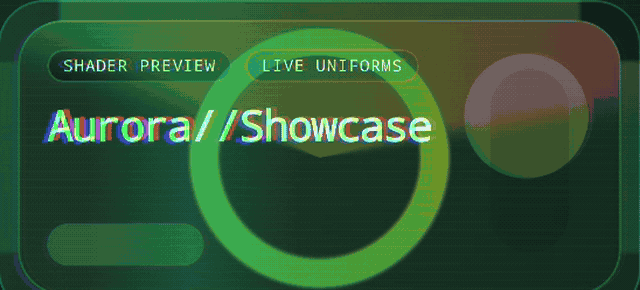
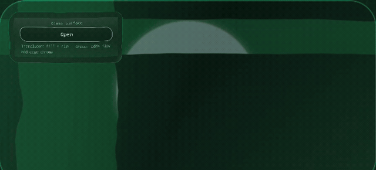
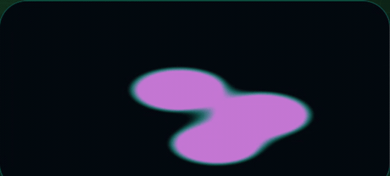
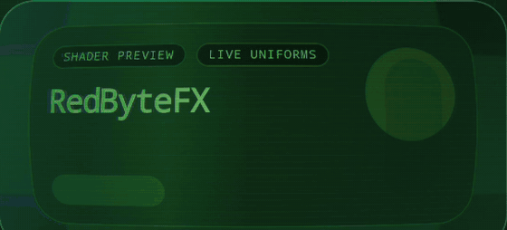
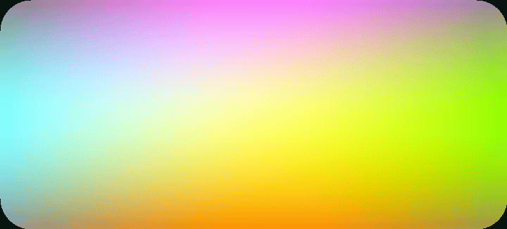
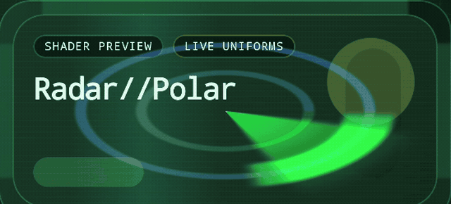

[English](README.md) · **Русский**

# RedByteFX

**RedByteFX** — библиотека для создания графических эффектов и сцен на Android с помощью Kotlin. Вместо длинной строки на AGSL или GLSL вы описываете координаты, цвета, время, текстуры и фигуры в типизированном Kotlin DSL. Библиотека превращает это описание в программу для видеочипа. Получившийся код можно посмотреть через `agslSource()`, `vertexSource()` или `fragmentSource()`.

Есть два пути. **Эффекты** меняют уже готовую картинку: создают волну, свечение, цветовой фильтр или переход. AGSL применяет такой эффект к содержимому Android, а OpenGL ES может нарисовать его на весь экран. **Сцены** рисуют свои объекты с вершинами, камерой, текстурами и освещением через OpenGL ES.

Математика остаётся на виду. Волна сдвигает точку, из которой пиксель берёт цвет, по синусоиде; мягкое свечение начинается с расстояния до выбранной точки. Для частых задач есть готовые функции: маски, градиенты, шум, преобразования и смешивание цветов. Их можно сочетать со своими вычислениями.

Для эффектов AGSL нужен **Android 13 / API 33**. Сцены OpenGL ES работают с **Android 7 / API 24**. Минимальная версия Android для библиотеки — API 24.

<table>
  <tr>
    <td align="center"><br>Аврора</td>
    <td align="center"><br>Жидкое стекло</td>
    <td align="center"><br>Метаболы</td>
  </tr>
  <tr>
    <td align="center"><br>CRT</td>
    <td align="center"><br>Градиент</td>
    <td align="center"><br>Радар</td>
  </tr>
</table>

Клипы сняты в [приложении с примерами](sample/). Можно также [скачать APK](https://github.com/i-redbyte/redbytefx/releases/download/v1.1.0/redbytefx-sample-1.1.0.apk).

## Подключение к новому проекту

Убедитесь, что проект использует `mavenCentral()`. Добавьте нужные модули в `build.gradle.kts` приложения (текущая версия — **1.1.0**):

```kotlin
dependencies {
    implementation("io.github.i-redbyte:redbytefx-core:1.1.0")
    implementation("io.github.i-redbyte:redbytefx-compose:1.1.0")    // AGSL в Compose
    implementation("io.github.i-redbyte:redbytefx-gl:1.1.0")         // рантайм OpenGL ES
    implementation("io.github.i-redbyte:redbytefx-gl-compose:1.1.0") // OpenGL ES в Compose
    implementation("io.github.i-redbyte:redbytefx-stdlib:1.1.0")     // необязательные готовые функции
}
```

Для эффекта AGSL на обычном Android `View` достаточно `redbytefx-core`. Для AGSL в Compose добавьте `redbytefx-compose`. Для OpenGL-сцены нужны `redbytefx-gl` и, если используете готовую поверхность Compose, `redbytefx-gl-compose`. Модуль `redbytefx-3d` можно подключить отдельно для работы с мешами и камерой.

## Первый эффект на AGSL

Эффект сдвигает точку, из которой каждый пиксель берёт цвет. Синусоида смещает соседние столбцы на разную величину. Одна и та же программа `ShaderProgram` подходит для Compose и обычного Android `View`.

```kotlin
import ru.redbyte.redbytefx.*

fun waveProgram(): ShaderProgram = shader(ShaderTarget.Agsl) {
    fragment {
        val offset = float2(0f, sin(fragCoord.x * 0.08f) * 12f)
        sample(fragCoord + offset)
    }
}
```

**Экран на Compose:** запоминаем программу и накладываем эффект на элемент интерфейса.

```kotlin
@RequiresApi(33)
@Composable
fun WaveText() {
    val program = remember { waveProgram() }
    val controller = rememberFxController(program)
    Text("RedByteFX", modifier = Modifier.redbyteFx(controller))
}
```

В Activity на API 33+ вызовите `setContent { WaveText() }`. Импорты для примера: `androidx.annotation.RequiresApi`, `androidx.compose.runtime.*`, `androidx.compose.material3.Text`, `androidx.compose.ui.Modifier` и `ru.redbyte.redbytefx.compose.*`.

**Экран на View:** прикрепляем AGSL к `TextView`. При изменении размеров передаём шейдеру ширину и высоту; входной картинкой становится сам нарисованный `View`.

```kotlin
@RequiresApi(33)
fun waveTextView(context: Context): TextView {
    val instance = waveProgram().newAgslInstance()
    return TextView(context).apply {
        text = "RedByteFX"
        addOnLayoutChangeListener { view, _, _, _, _, _, _, _, _ ->
            instance.setResolution(view.width.toFloat(), view.height.toFloat())
            view.setRenderEffect(instance.renderEffect())
        }
    }
}
```

В Activity на API 33+ вызовите `setContentView(waveTextView(this))`. Импорты: `android.content.Context`, `android.widget.TextView`, `androidx.annotation.RequiresApi` и `ru.redbyte.redbytefx.*`. Если позже меняете параметр шейдера, после изменения ещё раз вызовите `setRenderEffect(instance.renderEffect())`.

Если хочется подробнее разобраться с AGSL, прочитайте [«Маяк в пустыне: Kotlin DSL для Android-шейдеров»](https://habr.com/ru/articles/1022546/). Статья написана для более ранней версии API; для версии 1.1.0 ориентируйтесь на примеры здесь.

## Первая сцена на OpenGL ES

Три вершины образуют треугольник. Вершинный этап ставит их на экран, а фрагментный окрашивает пиксели внутри. В отличие от эффекта AGSL, эта сцена сама рисует картинку.

```kotlin
import ru.redbyte.redbytefx.*

fun triangleProgram(): ShaderProgram = shader(ShaderTarget.Gles30) {
    vertex {
        val position = attributeVec2("position")
        glPosition(vec4(position.x, position.y, 0f.lit, 1f.lit))
    }
    fragment { vec4(0.85f.lit, 0.35f.lit, 0.2f.lit, 1f.lit) }
}
```

**Экран на Compose:** `GlSurface` создаёт OpenGL-поверхность, загружает вершины и рисует сцену. Положение вершин по каждой оси задаётся числами примерно от −1 до 1.

```kotlin
@Composable
fun TriangleScene() {
    val program = remember { triangleProgram() }
    val mesh = remember {
        GlMesh(
            vertices = floatArrayOf(-0.6f, -0.5f, 0.6f, -0.5f, 0f, 0.7f),
            stride = 2,
            attribs = listOf(GlAttrib("a_position", 2, 0)),
        )
    }
    GlSurface(
        controller = rememberGlController(program),
        mesh = mesh,
        modifier = Modifier.fillMaxSize(),
        onFrame = {},
    )
}
```

В Activity вызовите `setContent { TriangleScene() }`. Импорты: `androidx.compose.runtime.*`, `androidx.compose.foundation.layout.fillMaxSize`, `androidx.compose.ui.Modifier` и `ru.redbyte.redbytefx.gl.compose.*`.

**Экран на View:** разместите ту же сцену в `ComposeView`. Остальная часть Activity или Fragment может оставаться на View, а `GlSurface` сам управляет контекстом OpenGL и рисованием.

```kotlin
val triangleView = ComposeView(this).apply {
    setContent { TriangleScene() }
}
setContentView(triangleView)
```

Импортируйте `androidx.compose.ui.platform.ComposeView`. `ComponentActivity` предоставляет жизненный цикл, нужный `GlSurface`. Для полностью самостоятельного `GLSurfaceView.Renderer` в модуле `redbytefx-gl` есть `GlProgramRuntime`, но тогда контекст EGL и буферы вершин нужно вести вручную.

## Примеры

В [приложении с примерами](sample/) есть эффекты AGSL и сцены OpenGL ES. Начните с этих примеров, затем откройте полный [каталог AGSL](sample/src/main/java/ru/redbyte/redbytefx/sample/model/Demo.kt) и [каталог OpenGL](sample/src/main/java/ru/redbyte/redbytefx/sample/ui/gl/GlExampleList.kt):

| Пример | Как устроена картинка |
| --- | --- |
| Wave | Синусоида сдвигает точку, из которой каждый пиксель берёт цвет. |
| Aurora | Светящееся кольцо, вращающаяся полоса и небольшие сдвиги цветовых каналов создают переливы. |
| Liquid Glass | Искривлённые координаты и яркий ободок делают изображение похожим на движущееся стекло. |
| Metaballs | Расстояния до движущихся кругов смешиваются, поэтому близкие круги сливаются. |
| CRT Terminal | Изогнутые координаты, строки развёртки и разделённые цвета напоминают старый экран. |
| Triangle (OpenGL ES) | Три вершины задают область, а видеочип закрашивает пиксели внутри неё. |
| Lamp (OpenGL ES) | Поверхность ярче, когда её направление обращено к источнику света. |
| Ocean (OpenGL ES 3.2) | Участок дробится на части, а синусоиды поднимают и опускают его вершины. |

UV — это место на картинке, обычно от 0 до 1 по каждой оси. *Маска* — число от 0 до 1, которое указывает, где виден эффект. *Нормаль* показывает направление от поверхности и помогает считать освещение.

<details>
<summary>Все 61 пример приложения, по одной строке на каждый</summary>

### Эффекты AGSL

| Пример | Как работает математика |
| --- | --- |
| Flip | Заменяет координату выборки расстоянием до противоположного края (`width - x` или `height - y`), переворачивая изображение. |
| Mirror | Отражает координаты с одной стороны центра: обе половины берут цвет из одной и той же половины картинки. |
| Rotate | Переносит координаты вокруг центра с помощью синуса и косинуса, затем берёт цвет в повёрнутой точке. |
| Scale | Считает расстояние от координаты до центра и делит его на масштаб перед выборкой цвета. |
| Offset | Прибавляет двумерное смещение к координатам выборки, сдвигая картинку. |
| Wave | Прибавляет синусоиду к вертикальной координате выборки: соседние столбцы сдвигаются по-разному. |
| Pulse | Округляет UV до сетки пикселей, а время, номер строки и бегущий столбец подсвечивают отдельные ячейки. |
| Signal | Повторяет координаты в виде сетки; пороги и плавные границы превращают её части в строки развёртки. |
| Posterize | Округляет цвета до меньшего числа уровней и смешивает результат с исходной картинкой. |
| Film | Добавляет меняющееся зерно и затемняет пиксели ближе к краям с помощью маски виньетки. |
| Grade | Меняет насыщенность и смешивает тонированные версии исходного цвета по формулам смешивания. |
| Warp | Сдвигает UV с помощью нескольких слоёв шума и берёт цвет в искривлённых точках. |
| Prism | Берёт цветовые каналы в чуть разных точках и добавляет повторяющуюся цветовую палитру. |
| Spotlight | Считает расстояние до заданного центра; мягкие маски оставляют центр ярким, а края затемняют. |
| Beacon | Двигает световое пятно туда и обратно по времени; сглаживание замедляет его у концов пути. |
| Composite | Использует маски как веса при смешивании исходной картинки с другими цветами или слоями. |
| Frame | Считает расстояние до краёв картинки и подсвечивает узкую полосу, рисуя рамку. |
| Corner | Соединяет небольшие маски у углов с движущейся полосой света, рисуя скобки интерфейса. |
| Reveal | Сравнивает координату пикселя с подвижной границей; мягкий переход постепенно показывает перекрашенную версию картинки. |
| Sweep | Считает положение вдоль выбранного направления и проводит по картинке мягкую световую полосу. |
| Glitch | Сдвигает отдельные горизонтальные полосы и добавляет помехи, похожие на сбой экрана. |
| Radar | Переводит положение относительно центра в расстояние и угол, затем рисует дуги и вращающийся сектор сканирования. |
| Halo | Считает расстояние от центра с учётом пропорций экрана, подсвечивая кольцо и середину. |
| Circuit | Считает расстояние до отрезков и кругов; импульсы бегут по выбранным дорожкам. |
| Sigil | Считает расстояние со знаком до кругов и прямоугольников: внутри знак отрицательный, возле нуля получается мягкий контур. |
| Duotone | Вычисляет яркость исходного цвета и по ней смешивает два выбранных цвета. |
| Aurora | Складывает светящееся кольцо, вращающийся сектор, меняющуюся палитру и чуть смещённые цветовые каналы. |
| Liquid Glass | Искривляет координаты выборки, будто свет проходит сквозь текучее стекло; разделяет цвета у края и подсвечивает ободок. |
| Animated Gradient | Синусоиды по UV и времени плавно меняют красный, зелёный и синий каналы. |
| Physics Bubble | Compose двигает пузырь при перетаскивании и возвращает его пружиной; шейдер искривляет фон и окрашивает тонкую плёнку у края. |
| Touch Ripple | Расстояние от точки касания и прошедшее время задают расширяющиеся цветные кольца поверх картинки. |
| Metaballs | Считает расстояние до трёх движущихся кругов и плавно объединяет их поля, чтобы круги сливались. |
| CRT Terminal | Искривляет координаты выборки, сдвигает красный и синий у края и меняет яркость тонкими строками. |

### Сцены OpenGL ES

| Пример | Как работает математика |
| --- | --- |
| Triangle | Передаёт три вершины на экран; пиксели внутри полученного треугольника окрашиваются. |
| Effect | Рисует треугольник на весь экран; расстояние до вращающегося шестиугольника даёт мягкий край, а время меняет цвет. |
| Spheres | Обновляет положение и скорость шаров; столкновения с краем и друг с другом меняют направление. Освещение зависит от направления поверхности шара. |
| Flag | Добавляет к вершинам полотна синусоиды, зависящие от времени; высота и положение задают складки. |
| Neon floor | Перспектива уменьшает дальние клетки; повторяющиеся координаты рисуют линии, а время двигает их к камере. |
| Lamp | Поворачивает вершины и нормали поверхности; угол между нормалью и направлением света задаёт яркость. |
| City | Расставляет текстурированные блоки в 3D и двигает камеру вокруг них с помощью синуса и косинуса. |
| Lit crate | Матрицы камеры и проекции показывают ящик с текстурами; угол между нормалью и светом осветляет повёрнутые к нему грани. |
| Planet | Координаты сферы задают поверхность и орбиты спутников; направление света, смешивание цветов и жесты меняют вид сцены. |
| Slice | Использует один индексированный меш, но рисует только начало списка индексов: ползунок открывает новые квадраты. |
| Stamp | Переводит касание в координаты текстуры и меняет небольшой прямоугольник её пикселей. |
| Sky | По направлению от сферы выбирает одну из шести граней кубической текстуры и берёт её цвет. |
| Mirror | Сначала рисует треугольник в текстуру, затем накладывает эту текстуру на другой прямоугольник. |
| Mips | Показывает клетчатую текстуру с уменьшенными копиями и без них; копии сглаживают далёкие мелкие детали. |
| Glass orb | Вычисляет точку пересечения луча со сферой; ободок ярче там, где поверхность отвернулась от зрителя. |
| Iso bands | Складывает движущиеся синусоиды в одно поле и сравнивает его с порогами, получая цветные полосы. |
| Palette | Переводит высоту и время в повторяющуюся радугу; синус и косинус задают форму объёмной арки. |
| Hedgehog | Находит центр и внешнее направление каждого треугольника, затем добавляет точку в этом направлении — получается шип. |
| Ocean | Находит точки внутри участка между его углами и поднимает их двумя синусоидами, создавая волны. |
| Wireframe | Превращает каждое ребро треугольника в тонкую полосу, показывая каркас меша. |
| Electric sea | Складывает тонкие извилистые линии молний и сетку мерцающих звёзд. |
| red_byte | Обновляет положение букв по времени: они падают, после чего слово меняет цвет и перекатывается в сторону. |
| Tunnel | Перспектива приближает кольца коридора; сравнение положения корабля с отверстием кольца засчитывает точный пролёт. |
| Maze | Двигает шар по наклону поля и проверяет столкновения с коробками-стенами; свет делает шар объёмным. |
| Breakout | Меняет направление мяча при касании стен, ракетки и кирпичей; задетые кирпичи исчезают. |
| Raid | Двигает камеру вперёд и проверяет попадания по врагам на разной глубине; попадание даёт короткую вспышку. |
| Descent | Перспектива расставляет ворота на склоне; сравнение положений лыжника и ворот решает, засчитать ли проезд. |
| Lit mesh | Вращает текстурированную сферу; угол между нормалью и светом задаёт её рассеянную яркость. |

</details>

## Документация

- [Справочник API](https://i-redbyte.github.io/redbytefx/) — открытые классы и функции.
- [Справочник языка шейдеров](docs/language-reference.md) — выражения, типы, параметры и этапы.
- [История изменений](docs/changelog.ru.md) — выпуски и нововведения.

## Лицензия

[MIT](LICENSE)

## Участие

Хотите попробовать свой эффект, улучшить пример или исправить неудобство? Будем рады issue и pull request, в том числе рассказам о работе на реальных устройствах. Перед отправкой PR запустите `./gradlew qualityCheck`: команда выполняет модульные тесты, проверяет компиляцию примера и стиль Kotlin. Даже небольшой и понятный пример — хороший вклад в проект.
